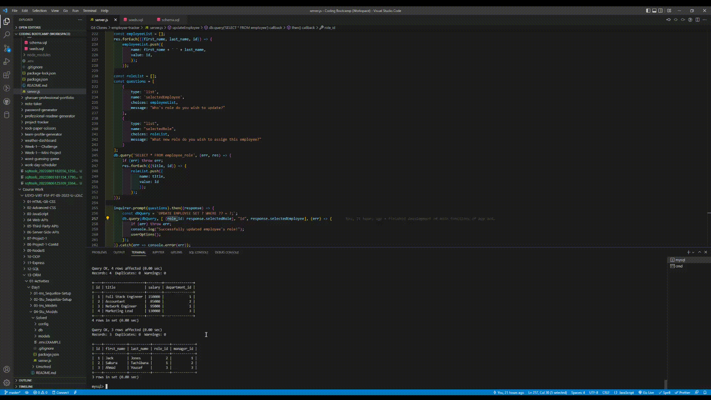

# Employee Tracker
## Table of Contents
  - [Description](#description)
  - [Installation](#installation)
  - [Usage](#usage)
  - [Demo](#demo)

## Description
This application is an employee tracker. It can be used to track company departments (such as sales, engineering, etc.), roles (Network Engineer, Marketing Lead, etc) and employees. It can also be used to add new departments, roles and employees as well as update existing employees.

## Installation
To install this application, simply download the repository using your desired method:
1. Run 'git clone' with the SSH link in your command line.
2. Download the zip file by clicking on the green 'code' button then clicking 'download zip'.

## Usage
To use this application, open your preferred command line application, navigate to where folder in which 'server.js' is located and run the command 'npm i' to install dependencies. Then you can run either 'node server.js' or 'npm start'.

## Demo

You can also view the demo in video form <a href='https://watch.screencastify.com/v/xjBBXd5ZiDU3mgS42e5k'>here</a>.
